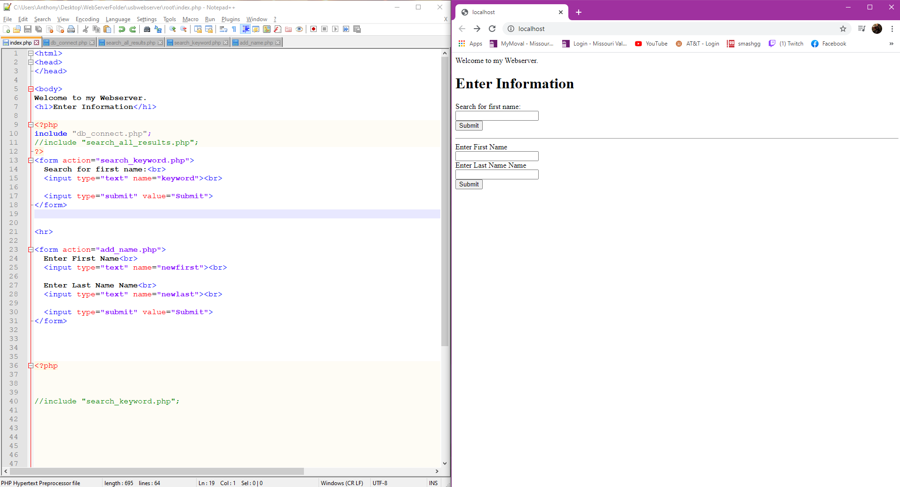

# InternetProgrammingAssignment2
Assignment 2

# CSS Dynamic WEBSITE - INTERNET PROGRAMMMING 

In this assignment I had to Create a web-page that consists of dynamic features, i.e., a signup form that is associated with mySQL table named "NewUsers". The form can be used to post data to mySQL table and fetch data from mySQL table displaying it on a webpage. Language to be used is "PHP" ONLY.

The tools I used were Notepad++, USB-Webserver program, w3-schools website for some formatting.
  
  
 This first image is my Index page. I moslty used this page to for formatting and input spaces.  

I came across a tip, which was to move the php code to another form to keep it neat and short. before i moved the code to a different page I had over 100+ lines of code. 
so i moved the php code to another page. the first step was to move the connection php to another page as shown in this next picture.

