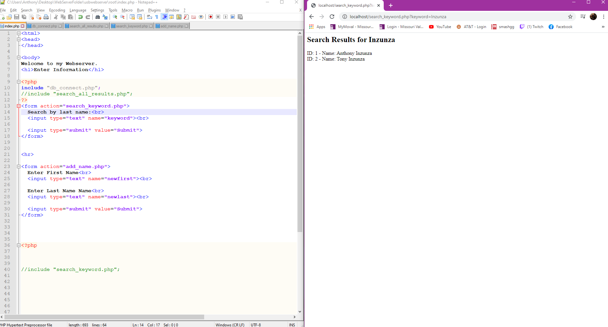
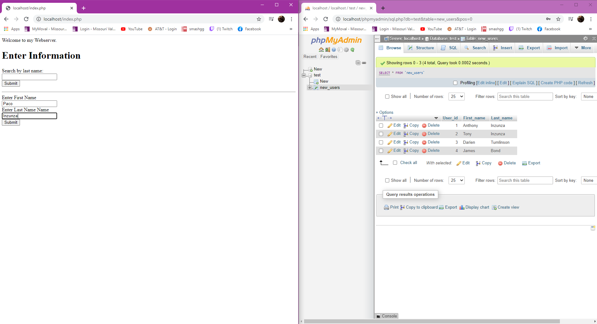
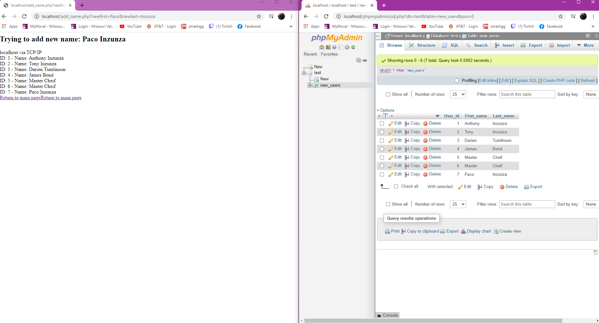

# InternetProgrammingAssignment2
Assignment 2

# CSS Dynamic WEBSITE - INTERNET PROGRAMMMING 

In this assignment I had to Create a web-page that consists of dynamic features, i.e., a signup form that is associated with mySQL table named "NewUsers". The form can be used to post data to mySQL table and fetch data from mySQL table displaying it on a webpage. Language to be used is "PHP" ONLY.

The tools I used were Notepad++, USB-Webserver program, w3-schools website for some formatting.
  
  
 This first image is my Index page. I moslty used this page to for formatting and input spaces.  

I came across a tip, which was to move the php code to another form to keep it neat and short. before i moved the code to a different page I had over 100+ lines of code. 
so i moved the php code to another page. the first step was to move the connection php to another page as shown in this next picture.

My next step was to make the code to search the data base for a name. since last names are more unique, i made sure to make the search go by last name. 
here is the picture for this step 
here is the code to search for a name

the picture below is to show the user entering a name to search. 

Picture below is to show the results of entering a last name to search by. Since there were 2 people by the name Inzunza in the table it came up with 2 names from the database. 

The next step was for the user to enter a name and then have it entered into the database table as well. to keep the code clean i used another page for this. 
here is a before to see the database and how the page looks. 

database before new name added

database after new name added
and then the after image once the submit button is clicked. 

as you can see there are only 4 names in the table before and then after i added a few names you can see the table is updated with the new names. the website also prints all of the names in the table to make sure it was added. 

